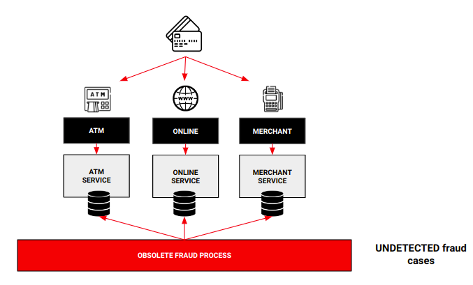
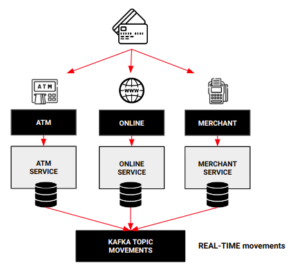
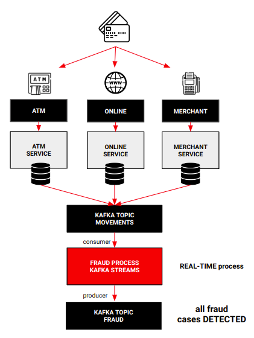
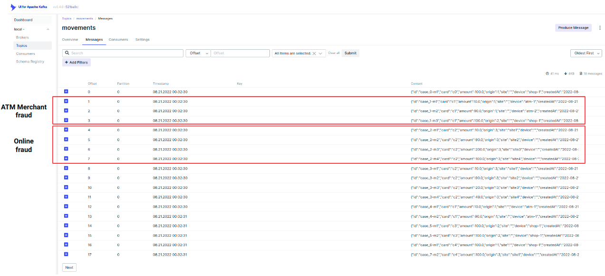
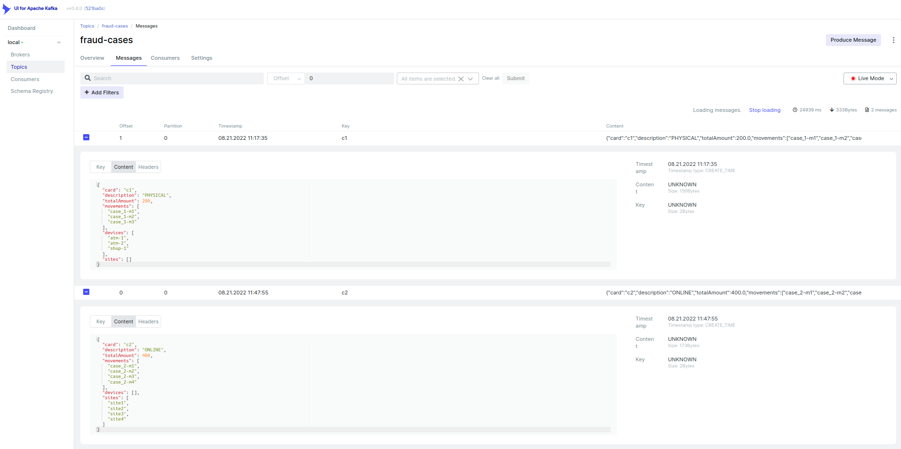

# Fraud Checker Project

This project defines how to use Kafka Streams to resolve a common use case like fraud detection in real time within a banking organization.

We'll use Kafka Streams, a client library for building applications, where the input and output are stored in Kafka clusters. It combines the ease of implementing applications in languages like Java, with the benefits of Kafka technology.

If you want to learn more about Kafka Streams and Processor API, please visit its documentation: https://kafka.apache.org/documentation/streams/developer-guide/dsl-api.html .


##### Requeriments

- Docker (to build the associated infrastructure)
- JDK 11+

## The use case

A banking organization is having trouble controlling fraud over card transactions because the current solution, batch based, Card movements are generated in three channels: ATM, online and merchants. Current solution gets movements from these sources several times per day and then, examines the movements in order to detect suspicious behaviour. The followin picture shows this scenario:



This solution is very inefienct because some cases are not detected and others are detected so late. Because of that, the company needs to detect potential fraud operations in real time in order to improve security, avoid problems related to this practice and maintain clients confidence. How can we solve this problem?

## The solution: streaming

In order to create a solution to detect fraud cases in real time, we have to face two key points:

- have access to all the movements in real time
- be able to examine all those movements in real time in order to detect fraudulent patterns

To achieve the first point, for instance, we could deploy a CDC tool in order to publish in real time (or near real time) every change in movements sources to an event bus like Kafka. Then, once the movements are in the event bus, to achieve the second point, we are going to use an streaming solution. In this case: Kafka Streams Processor API

In this repository we are not going to implement the CDC solution, so we'll assume that movements will be pusblished to a topic (like "movements") in Kafka in real time:



We do learn how to analyze this stream of movements to find suspicious patterns. Once all the data is accessible and centralized in a Kafka topic, we implement a topology to detect two patterns within the stream:

- Two or more movements from different ATM or merchants within a sort period of time
- More than 4 movements from ATM or merchants within a sort period of time independently of its device (same ATM or not
- Multiple online movements exceeding a defined amount

If these patterns are detected, a fraud case is generated. That means that an event will be published in another Kafka topic (for instance, "fraud-cases") in order to make the pertinent decisions with that revealed data and confirm or not the fraudulent behaviour.



## How is structured this repo?

In this repo you'll find these folders:

- **apps**: it contains two Spring Boot applications
  - **Movements Generator:** this application exposes a Rest API to help us to publish movements to Kafka
  - **Fraud Checker:** Kafka Streams (Processor API) application that examines the stream of movements looking for the patterns explained before. This is the most important application of this repo
- **platform**: it contains the *docker-compose* file to launch a demo environment to really understand how all the components works and fraud cases are detected. The platform is composed of:
  - Zookeeper
  - Kafka
  - Kafka UI
  - Movements Generator App
  - Fraud Checker App
- **demo**: this folder contains the necessary scripts to execute the demo
  - *1-init.sh*: this script builds the docker images and launch the different docker containers
  - *2-generate-movements.sh*: this scripts calls to the Rest API exposes by the Movement Generator app, publishing to kafka multiple cards movements to the Fraud Checker app can detect fraud cases
  - *3-stop.sh*: this scripts destroy the environment.
- **doc**: this folder only contains document assets

## Executing the demo

Executing the demo is very easy. As we've seen in the previous section, there are some scripts to help us to execute all the necessary taks.

The first step is going to demo folder because all the scripts are going to be executed from there:

```bash
cd demo
```

Once in the demo folder, we have to execute the script creating and initializing the environment. To do that, just write:

```bash
sh 1-init.sh
```

When the script ends, we'll see something like this:

```bash
[+] Running 7/7
 ⠿ Network platform_default           Created                                                                                                                                                                                                                                
 ⠿ Container zookeeper                Healthy                                                                                                
 ⠿ Container broker                   Healthy                                                                                                
 ⠿ Container fraud-checker            Started                                                                                                
 ⠿ Container fraud-checker-generator  Started                                                                                                
 ⠿ Container kafka-ui                 Started                                                                                                
 ⠿ Container init                     Started                                                                                                

Waiting for platform to be ready....
Platform ready!
Now you can execute the next script to send movements automatically to the broker or sending manually
To execute the script:
    sh 2-generate-movements.sh


```

Now, the environment is up and running. So, the next step is generating multiple movements in order to detect fraud cases:

```bash
sh 2-generate-movements.sh
```

Once the movements are published, the script will show the following links:

```
-------------------------------
Movements topic: http://localhost:9081/ui/clusters/local/topics/movements
Fraud case topics: http://localhost:9081/ui/clusters/local/topics/fraud-cases
-------------------------------
```

Now, if we go to the first link (Kafka UI - movements topic) we'll check that multiple movements have been published to the topic ***movements*** to be used as data to test our fraud detector.



And, if we go to the second link (Kafka UI - fraud cases topic) we'll check that two fraud cases have been detected and published to the topic **fraud-cases**:



## How to destroy the environment

Finally, to destroy the environment, we simply have to run the following script:

```bash
sh 3-stop.sh
```
